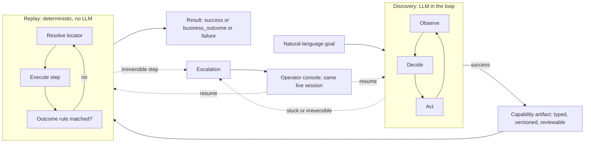
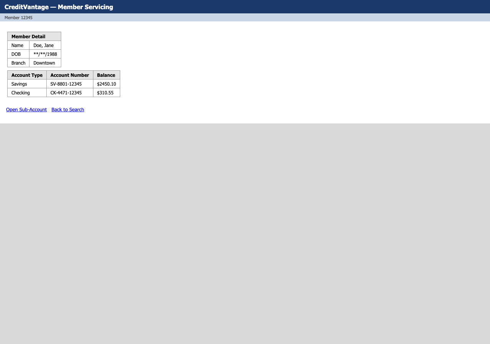

# Computer-Use Automation System

An LLM discovers how to operate a back-office web console the first time; the run is
recorded as a typed, versioned **capability artifact**; that artifact then **replays
deterministically**, with no model in the loop, verifying checkpoints and classifying
runtime outcomes (business outcome / recoverable / hard failure). When it can't safely
proceed, it pauses and hands the live session to a human operator, then resumes.

Built for [interface.ai's take-home brief](./REPORT.md): the agent-facing product decides
*what* to do; this is how it reliably and safely does it inside software that has no API.

**[REPORT.md](./REPORT.md)** is the design write-up (architecture, schema, determinism,
multi-tenant story, escalation model, safety, cuts). **[evidence/](./evidence/)** has logs
and screenshots from real discovery and replay runs -- success, two kinds of business
outcome, a hard failure, and two full human-in-the-loop escalations.

## At a glance



A real extraction step from the actual saved artifact -- note the locator is a row-relative
XPath keyed on a stable label, not on the balance's own (variable) value:

```json
{
  "id": "s7", "type": "extract", "outputName": "savings_balance",
  "target": {
    "description": "Extract savings_balance",
    "candidates": [
      { "strategy": "xpath", "expression": "//tr[td[1][normalize-space()='Savings']]/td[3]" }
    ],
    "rationale": "Row-relative: identified by the stable row label \"Savings\" plus a fixed column offset, not by the cell's own (variable) value."
  }
}
```

And the discovery agent's actual view of that same page (screenshot from
`evidence/discovery-creditvantage-lookup-member-balance-*/screenshots/07-after-action.png`):



## Where each evaluation criterion is addressed

| Criterion | Where |
|---|---|
| System design | [REPORT.md §1-2](./REPORT.md#1-architecture) |
| Correctness of the core loop | [evidence/](./evidence/) (real discovery + replay runs); [`src/agent/`](./src/agent/), [`src/replay/`](./src/replay/) |
| Robustness & error handling | [REPORT.md §3](./REPORT.md#3-determinism--error-handling) -- includes a real locator bug found and fixed during testing, with a regression test |
| Human-in-the-loop escalation | [REPORT.md §5](./REPORT.md#5-escalation--handoff); [`src/handoff/`](./src/handoff/); two resolution paths in `/evidence/` |
| Generalization to the real environment | [REPORT.md §4](./REPORT.md#4-heterogeneity--multi-tenant) |
| Safety & data handling | [REPORT.md §6](./REPORT.md#6-safety); [`src/guardrails/`](./src/guardrails/) |
| Code quality | `npm test` (22 unit tests: locators, guardrails, schema); `npm run typecheck` |
| Communication | [REPORT.md](./REPORT.md), this README, [evidence/README.md](./evidence/README.md) |

## What's here

- `target-app/` -- a mock "CreditVantage" credit-union servicing console (Express,
  server-rendered, table layouts, no test IDs) standing in for a legacy back-office app.
  Not the real thing -- see REPORT.md and the assignment brief for why a proxy target is
  the right call here.
- `src/agent/` -- the discovery loop (observe → decide → act) and the session it drives.
- `src/browser/` -- perception (element indexing) and locator-building.
- `src/replay/` -- the deterministic replay engine.
- `src/guardrails/` -- allowlist, risk classification, redaction, secrets.
- `src/handoff/` -- human-in-the-loop escalation and the operator console.
- `src/artifact/` -- the capability schema and file-based store.
- `scenarios/` -- the two natural-language goals used for discovery.
- `artifacts/` -- saved capability artifacts (JSON), produced by discovery.
- `evidence/` -- logs/screenshots from real runs (see `evidence/README.md`).
- `*.test.ts` files alongside the modules they test (locator building, guardrails,
  artifact schema) -- run with `npm test`.

## Setup

Requires Node 20+.

```bash
npm install
npx playwright install chromium
cp .env.example .env   # then edit values as needed
```

Everything below reads its config from `.env` (via `dotenv`) or matching env vars.

```bash
npm test         # 22 unit tests: locator building, guardrails, artifact schema
npm run typecheck
```

## Run without any live services / API key

You can exercise the **entire deterministic replay path** -- guardrails, locator
resolution, outcome classification, escalation/handoff -- using the capability artifacts
already committed in `artifacts/`, which came from real discovery runs (see
`evidence/README.md`). This needs only the target app running locally, no LLM API key:

```bash
# terminal 1
npm run target-app

# terminal 2
CVSS_USERNAME=ops_agent CVSS_PASSWORD=demo-pass npx tsx src/cli/replay.ts \
  creditvantage.lookup-member-balance --param memberId=12345
```

## Demo path: discovery → replay

### 1. Start the target app

```bash
npm run target-app        # http://localhost:4173
```

### 2. Run discovery (produces a new capability artifact)

With an `ANTHROPIC_API_KEY` set, this is fully automated -- Claude drives the browser via
tool-calling, no human input needed:

```bash
export ANTHROPIC_API_KEY=sk-ant-...
CVSS_USERNAME=ops_agent CVSS_PASSWORD=demo-pass \
  npx tsx src/cli/discover.ts scenarios/lookup-member-balance.json
```

This launches a headed browser (set `HEADLESS=true` to run invisibly), starts the operator
console at `http://localhost:4200`, and prints the saved artifact path
(`artifacts/creditvantage.lookup-member-balance/v1.json`) plus the evidence directory on
success. If an irreversible action is reached (see the `open-subaccount.json` scenario),
the run pauses and prints where to approve it -- open the operator console and click
**Resume**.

**Without an API key**, the identical session can be driven manually (this is how the
committed `artifacts/`/`evidence/` were actually produced -- see REPORT.md §1 and
`evidence/README.md` for why):

```bash
CVSS_USERNAME=ops_agent CVSS_PASSWORD=demo-pass \
  npx tsx src/cli/manual-discover-server.ts
# in another terminal:
curl -X POST localhost:4300/start -H 'content-type: application/json' \
  -d '{"scenarioPath":"scenarios/lookup-member-balance.json"}'
curl -X POST localhost:4300/act -H 'content-type: application/json' \
  -d '{"tool":"fill","ref":0,"value":"ops_agent","reasoning":"..."}'
# ...continue with click/fill/select_option/navigate/wait/extract/escalate/finish
```

### 3. Replay the resulting artifact (deterministic, no LLM)

```bash
CVSS_USERNAME=ops_agent CVSS_PASSWORD=demo-pass npx tsx src/cli/replay.ts \
  creditvantage.lookup-member-balance --param memberId=12345
```

Try a different member to prove it's parameterized, not hard-coded:

```bash
npx tsx src/cli/replay.ts creditvantage.lookup-member-balance --param memberId=99999
# -> {"status":"business_outcome","businessOutcome":{"code":"member_not_found",...}}
```

Try the irreversible-action capability, which pauses for approval unless you pass
`--allow-irreversible`:

```bash
npx tsx src/cli/replay.ts creditvantage.open-subaccount \
  --param memberId=34567 --param accountType=Checking \
  --param nickname="Rent Buffer" --param openingDeposit=150
# -> prints an intervention request + the operator console URL; approve it with:
curl -X POST localhost:4200/api/intervention/<id>/resume \
  -H 'content-type: application/json' -d '{"decision":"approve_and_continue"}'
```

Trigger a hard failure on demand (no target-app changes needed):

```bash
npx tsx src/cli/replay.ts creditvantage.lookup-member-balance \
  --param memberId=12345 --simulate error500
```

## Every run's evidence

Every discovery and replay run writes to `evidence/<runId>/`: `log.jsonl` (structured,
redacted event log), `screenshots/`, and for replay, `result.json`. See
`evidence/README.md` for an indexed walkthrough of the committed runs.

## Config

- `src/config/allowlist.json` -- allowed origins/routes/action types, and the regex
  patterns used to classify an action as irreversible.
- `.env` -- see `.env.example`.
